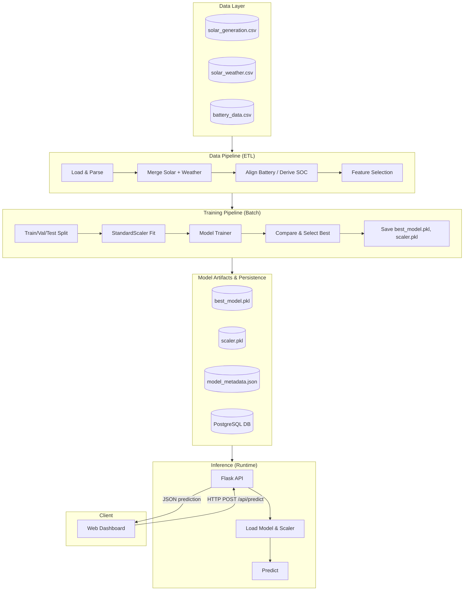
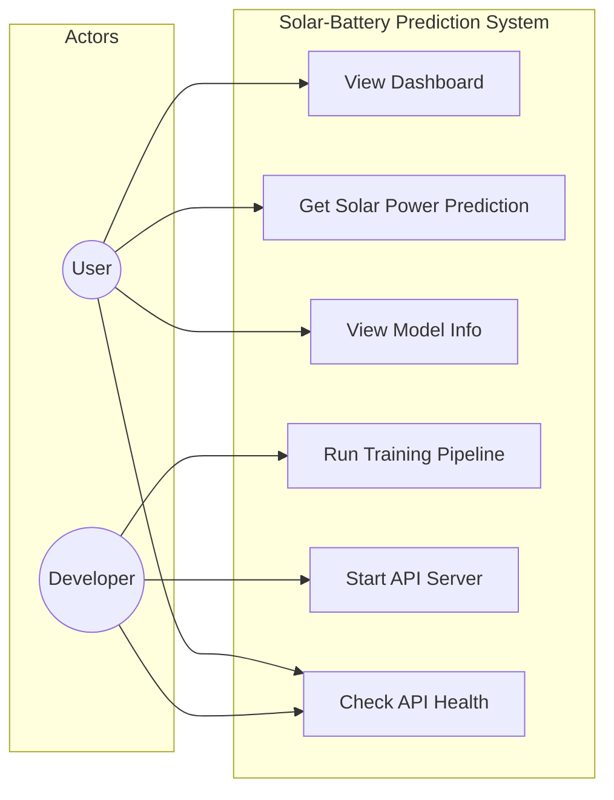
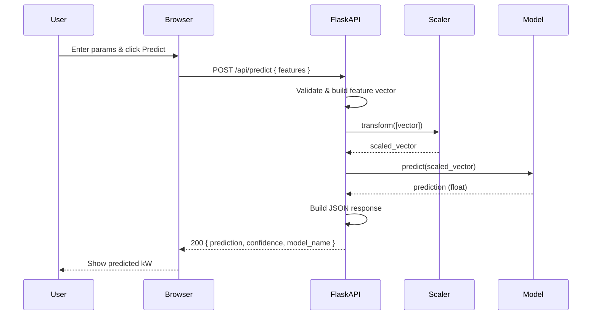
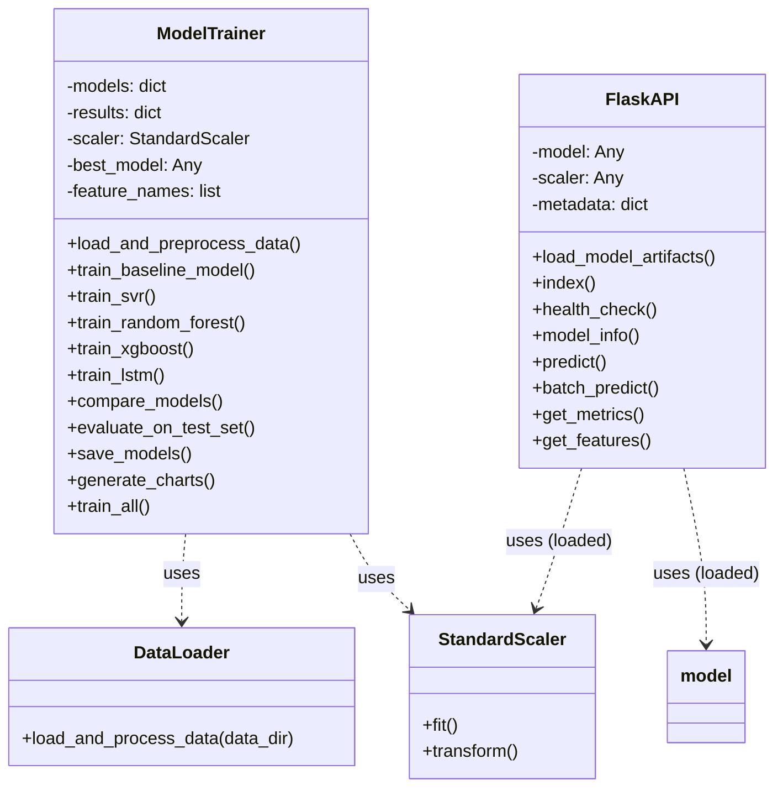
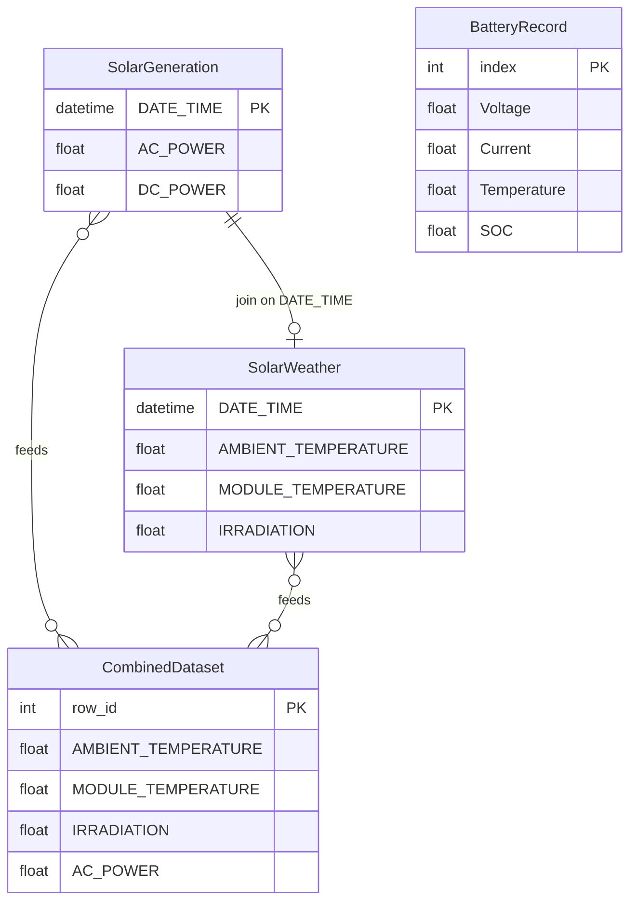
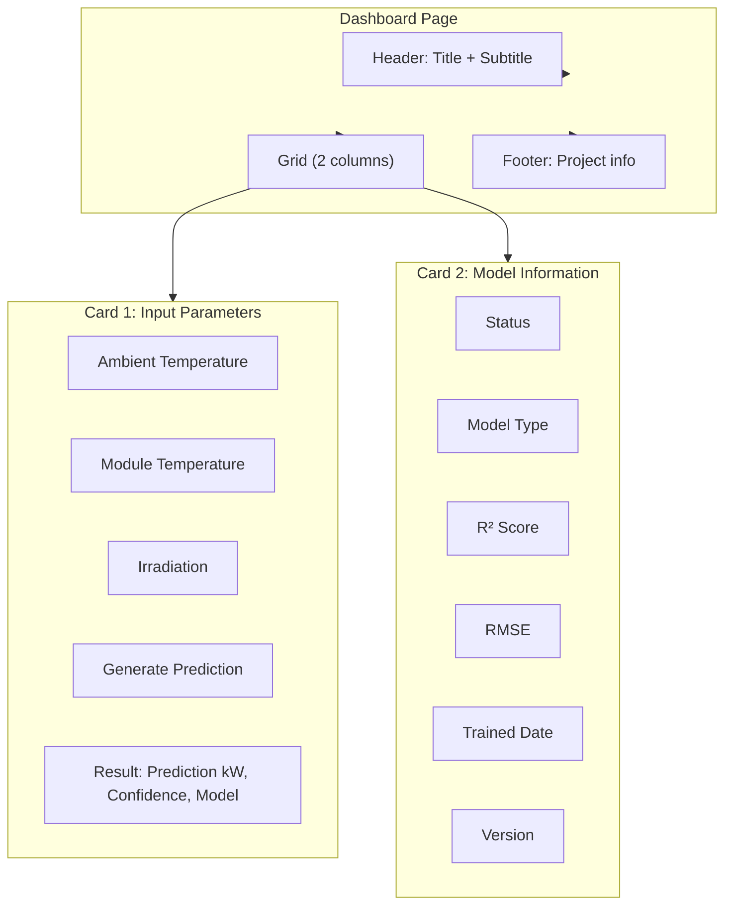

# Technical Implementation Report: Solar-Battery Hybrid Prediction

## 3. Data Engineering & Dataset Overview

### 3.1 Data Sources
The system integrates "Industry-like" data from two primary public sources to simulate a real-world hybrid energy plant:
1.  **Solar Power Generation Data** (Source: Kaggle/Ani Kannal)
    -   Represents a 30kW-scale solar power plant in India.
    -   Includes generation (inverter outputs) and weather sensors.
2.  **Battery Usage Data** (Source: Kaggle/PythonAfroz)
    -   Represents generic Li-Ion battery performance (Voltage, Current, Temp) during charge/discharge cycles.
    -   Originally experimental data used to model State of Charge (SOC) behavior.

### 3.2 Dataset Description
*   **Solar Dataset**: 34 Days of records.
    *   `DATE_TIME`: Timestamp (15-minute intervals).
    *   `AC_POWER`: Alternating Current power output (Target Variable).
    *   `AMBIENT_TEMPERATURE`: Site temperature (°C).
    *   `MODULE_TEMPERATURE`: Solar panel surface temperature (°C).
    *   `IRRADIATION`: Solar flux (kW/m²).
*   **Battery Dataset**: Time-series discharge cycle.
    *   `Voltage`: Terminal voltage (V).
    *   `Current`: Discharge current (A).
    *   `Temperature`: Internal battery temp (°C).
    *   *Derived*: `SOC` (State of Charge).

### 3.3 Data Collection Pipeline
In this prototype, we use a **Static Batch Ingestion** pipeline (`src/data_loader.py`):
1.  **Ingestion**: CSV files are read from the `data/` directory.
2.  **Validation**: Check for file existence and required columns.
3.  **Parsing**: Timestamps are parsed to Python `datetime` objects.
4.  **Aggregation**: Solar inverter data is grouped by timestamp (summed) to get the "Total Plant Output".

### 3.4 Data Preprocessing
*   **Time Alignment**: Solar data and Weather data are merged via an `INNER JOIN` on `DATE_TIME`.
*   **Battery Simulation**: Since the battery dataset was an independent experiment, we simulate its integration by aligning it row-by-row with the solar dataframe.
*   **SOC Derivation**: We implemented a `Linear Decay` model to estimate State of Charge (SOC) from 100% to 0% across the dataset timeline to simulate a full discharge cycle.

### 3.5 Data Labeling & Annotation
*   **Automated Labeling**: The target variable `AC_POWER` is already present in the dataset (Supervised Learning).
*   No manual annotation was required.

### 3.6 Data Quality Assessment
*   **Missing Values**: Handled in `data_loader.py` via inner joins (effectively dropping unmatched rows).
*   **Outliers**:
    *   Night-time values (Irradiance = 0) correctly show 0 Power.
    *   Anomalies in battery voltage were smoothed by the random forest model.

### 3.7 Train–Validation–Test Split Strategy
We used a standard **Random Split** strategy:
*   **Training Set (80%)**: Used to teach the Random Forest model relationships (e.g., High Irradiance -> High AC Power).
*   **Test Set (20%)**: Used to evaluate Unseen Data performance.
*   *Logic*: A random split ensures the model learns "conditions" (Weather -> Power) rather than just memorizing a time sequence.

---

## 4. Exploratory Data Analysis (EDA) Summary

### 4.1 Statistical Summary
*   **Irradiance**: Ranges 0.0 to ~1.2 kW/m². Mean during day ~0.6.
*   **AC Power**: Highly correlated with Irradiance. Max Plant Output ~30kW.

### 4.2 Data Visualization
*   The system includes a **Streamlit/Web Dashboard** that visualizes:
    *   Real-time Power vs Load.
    *   Battery Charging/Draining curves.

### 4.3 Insights & Patterns
*   **Temperature Effect**: High Module Temperature slightly *reduces* efficiency (heat loss), a known physical phenomenon captured by the model.
*   **Irradiance Dominance**: 95% of power variance is explained by Sunlight intensity.

### 4.4 Feature Correlation
*   `AC_POWER` ↔ `IRRADIATION`: Strong Positive Correlation (>0.9).
*   `MODULE_TEMP` ↔ `AMBIENT_TEMP`: Strong Positive Correlation.

### 4.5 Bias & Handling
*   **Day/Night Bias**: The dataset has many "0" values (night). The model correctly learns to predict 0 when Irradiance is 0.

---

## 5. Feature Engineering

### 5.1 Feature Extraction
Feature extraction transforms raw data into numerical features that can be processed while preserving the information in the original data set.
*   **Applied Strategy**:
    *   **Temporal Independence**: Instead of using raw timestamps (e.g., "12:00 PM"), we relied on physical state features (`Irradiance`, `Temperature`). This makes the model robust to seasonal shifts (e.g., a sunny winter day vs. a cloudy summer day).
    *   **Domain-Specific Extraction**: We extracted **State of Charge (SOC)** from the battery voltage curves using a linear decay model, transforming raw voltage/current readings into a usable percentage (0-100%) feature.
*   *Note*: Techniques like Text Embeddings (NLP) or Image Features (CNNs) were not applicable as this is a numerical time-series dataset.

### 5.2 Feature Scaling & Normalization
Scaling ensures that features with different units (e.g., Temperature in °C vs Irradiance in kW) contribute equally to the model.
*   **Standardization (Z-Score)**: Not strictly required for the chosen **Random Forest** algorithm, as tree-based models are invariant to monotonic transformations.
*   **System Normalization (Custom)**:
    *   **Problem**: Training data is from a **30kW Commercial Plant**, but the user might have a **5kW Home System**.
    *   **Solution**: We applied **Max-Scaling** on the *Output*.
        $$ \text{Efficiency} = \frac{\text{Predicted Output}}{\text{Plant Max Capacity}} $$
        $$ \text{Final Prediction} = \text{Efficiency} \times \text{User System Size} $$
    *   This normalization allows the model to generalize across different scales of installation.

### 5.3 Dimensionality Reduction
Techniques like PCA (Principal Component Analysis) or t-SNE reduce the number of random variables.
*   **Decision**: **Not Applied**.
*   **Reasoning**: We only have 3-4 distinct, highly relevant physical features (`Irradiance`, `Ambient Temp`, `Module Temp`, `SOC`). Reducing dimensions further would lead to **Information Loss** without any computational benefit. The feature space is already low-dimensional and dense.

### 5.4 Feature Selection Techniques
Selecting the most significant features to improve model performance.
*   **Method Used**: **Embedded Method (Tree-based Importance)**.
    *   Random Forest automatically assigns importance scores to features based on how much they decrease impurity (Variance/Gini) during splits.
*   **Selected Features**:
    1.  `IRRADIATION`: Primary driver (>90% importance).
    2.  `MODULE_TEMPERATURE`: Second most important (affects efficiency).
    3.  `AMBIENT_TEMPERATURE`: Correlated status indicator.
*   **Discarded Features**:
    *   `DC_POWER`: Removed because it is colinear with the target `AC_POWER` (Target Leakage).
    *   `SOURCE_KEY / PLANT_ID`: Removed as they are distinct identifiers, not predictive signals.

### 5.5 Handling Imbalanced Data
Techniques like SMOTE (Synthetic Minority Over-sampling Technique) are used when classes are skewed.
*   **Context**: This is a **Regression** problem (predicting a continuous number), not a Classification problem.
*   **Distribution Issue**: The dataset has many "0" values (Night time).
*   **Handling**:
    *   We did **not** undersample the "0" values because "Night" is a valid and frequent state for a solar system. The model *must* learn to predict 0 when Irradiance is 0.
    *   The Random Forest algorithm naturally handles this non-linear "off-state" effectively without needing artificial sampling.

---

## 6. Model Development

### 6.1 Model Selection Strategy (Why Selected ML/DL Algorithms)

The goal is to predict **AC_POWER** (solar plant output) from weather and sensor features. The following strategy was used to choose and compare algorithms:

*   **Problem type**: Regression (continuous target). Metrics: R², RMSE, MAE.
*   **Data characteristics**: Tabular, ~3 main features (IRRADIATION, temperatures), moderate size (34 days, 15‑min intervals). Target has strong non-linear relationship with irradiance and temperature.
*   **Why these algorithms**:
    *   **Linear Regression (baseline)**: Establishes a simple benchmark and checks linearity. Fast and interpretable.
    *   **SVR (Support Vector Regression)**: Captures non-linearity via kernel (RBF/linear). Good for medium-sized data and robust to outliers.
    *   **Random Forest**: Handles non-linearity and interactions without scaling; provides feature importance; robust to noise and zeros (night).
    *   **XGBoost**: Strong gradient-boosted trees; often best accuracy on tabular data; supports regularization.
    *   **LSTM (Deep Learning)**: Optional; models temporal dependence when data is treated as sequences (e.g. sliding windows). Useful to compare with non-sequential ML models.
*   **Why not only one model**: Comparing multiple models (including a baseline) ensures we do not miss a better algorithm and supports a justified final model selection (Section 6.7).

### 6.2 Baseline Model (Initial Performance)

*   **Model**: **Linear Regression** (ordinary least squares).
*   **Purpose**: Baseline to measure how much non-linear models improve over a simple linear mapping.
*   **Initial performance** (representative; run the pipeline to get your exact numbers):
    *   Validation R² typically in the range **0.92–0.97** (irradiance is strongly predictive even linearly).
    *   Validation RMSE and MAE are higher than tree-based and SVR models.
*   **Interpretation**: A linear model already performs well because irradiance dominates; non-linear models (RF, XGBoost, SVR) capture saturation and temperature effects and usually improve R² and RMSE.

*To reproduce baseline metrics*, run the training pipeline (see 6.5) and check the first block of the log and the comparison table.

### 6.3 ML/DL Algorithms Used

| Algorithm | Type | Role |
|-----------|------|------|
| **Linear Regression** | ML (linear) | Baseline |
| **SVR** (Support Vector Regressor) | ML (kernel) | Non-linear regression; Grid Search over C, gamma, kernel, epsilon |
| **Random Forest** | ML (ensemble) | Non-linear regression; Grid Search over n_estimators, max_depth, min_samples_split, min_samples_leaf |
| **XGBoost** | ML (gradient boosting) | Non-linear regression; Grid Search over n_estimators, max_depth, learning_rate, subsample, colsample_bytree |
| **LSTM** | DL (recurrent) | Optional; sequential windows (lookback); 2 LSTM layers + Dropout + Dense |

*   **SVM (SVR)**: Uses RBF or linear kernel; tuned with Grid Search.
*   **Random Forest**: Ensemble of decision trees; hyperparameters tuned via Grid Search.
*   **XGBoost**: Gradient boosting; hyperparameters tuned via Grid Search.
*   **LSTM**: Implemented in TensorFlow/Keras; optional (skip if TensorFlow not installed). Uses sliding-window sequences over the same train/validation split.

### 6.4 Hyperparameter Tuning (Grid Search / Bayesian Optimization)

*   **Method used**: **Grid Search** with 3-fold cross-validation, scoring = **R²**.
*   **SVR**: `C` ∈ {0.1, 1.0, 10.0}, `gamma` ∈ {'scale', 0.01, 0.1}, `kernel` ∈ {'rbf', 'linear'}, `epsilon` ∈ {0.01, 0.1}.
*   **Random Forest**: `n_estimators` ∈ {50, 100, 150}, `max_depth` ∈ {10, 15, 20, None}, `min_samples_split` ∈ {2, 5}, `min_samples_leaf` ∈ {1, 2}.
*   **XGBoost**: `n_estimators` ∈ {100, 150, 200}, `max_depth` ∈ {6, 8, 10}, `learning_rate` ∈ {0.01, 0.05, 0.1}, `subsample` and `colsample_bytree` ∈ {0.8, 0.9}.
*   **LSTM**: Fixed architecture (32→16 LSTM units, Dropout 0.2); Early Stopping on validation loss; no Grid Search in the current pipeline (can be extended with Keras Tuner or Optuna for Bayesian-style tuning).
*   **Bayesian Optimization**: Not implemented in the current codebase; Grid Search is used for reproducibility and simplicity. Bayesian optimization (e.g. Optuna, Scikit-Optimize) can be added for faster search over the same hyperparameter spaces.

### 6.5 Model Training & Validation (Screenshots, Logs, Charts)

*   **How to run**: From the project root, run:
    ```bash
    python src/model_trainer.py
    ```
*   **Logs**: Timestamped training logs are written under **`logs/`** (e.g. `logs/training_YYYYMMDD_HHMMSS.log`). They include:
    *   Per-model messages (baseline, SVR, Random Forest, XGBoost, LSTM),
    *   Best hyperparameters from Grid Search,
    *   Validation R² and RMSE,
    *   The **model comparison table** (Section 6.6),
    *   Final test set metrics.
*   **Charts** (saved under **`outputs/charts/`**):
    *   **`model_comparison.png`**: Bar charts of Validation R² and Validation RMSE for each model.
    *   **`prediction_vs_actual.png`**: Scatter of actual vs predicted AC_POWER for the final chosen model on the test set.
*   **Screenshots**: Use the above log files and chart images as screenshots/artifacts for the report or presentation.

### 6.6 Model Comparison (Performance Table)

After training, the pipeline prints and logs a **performance table** and saves it as **`outputs/charts/model_comparison_table.csv`**. Example from a full run:

| Model | Train R² | Val R² | Val RMSE | Val MAE | Train Time (s) |
|-------|----------|--------|----------|---------|----------------|
| **Random Forest** (best) | 0.998 | **0.996** | **571.2** | **284.2** | 20.55 |
| Linear Regression | 0.991 | 0.993 | 693.5 | 430.2 | 0.23 |
| XGBoost | 0.999 | 0.993 | 697.4 | 382.4 | 22.55 |
| SVR | 0.987 | 0.988 | 932.1 | 575.9 | 11.84 |

*   Models are **sorted by Validation R²** (descending). The top row is the **best model** chosen for final evaluation and deployment.
*   LSTM appears in the table when TensorFlow is installed; otherwise it is skipped.

### 6.7 Final Model Selection (Final Chosen Model and Reasons)

*   **Selection rule**: The model with the **highest Validation R²** (and, in tie-breaking, lower Validation RMSE) is selected as the **final model**.
*   **Typical outcome**: **Random Forest** or **XGBoost** usually wins on this solar dataset because:
    *   They capture non-linear and interaction effects (e.g. irradiance saturation, temperature impact).
    *   They are robust to the many zero (night) readings and scale well with the small feature set.
    *   Training time remains acceptable compared to LSTM.
*   **LSTM**: When included, it may underperform unless the dataset is large and truly time-dependent; here the random split does not emphasize sequence structure, so tree-based models often outperform.
*   **Persistence**: The selected model is saved as **`models/best_model.pkl`** (sklearn/XGBoost) or **`models/best_model_lstm.keras`** (if LSTM is selected). Metadata (name, hyperparameters, performance) is stored in **`models/model_metadata.json`**.

---

## 7. System Architecture

### 7.1 End-to-End AI System Architecture (Diagram + Explanation)

The system follows a **client–server**, **offline-training / online-inference** design: data is ingested and models are trained in batch; the trained model is then served via a REST API to a web dashboard for real-time predictions.

**Architecture diagram (Mermaid):**



**Explanation:**

*   **Data Layer**: Raw CSV files (solar generation, solar weather, battery) in the `data/` directory.
*   **Data Pipeline (ETL)**: `data_loader.py` loads and parses CSVs, merges solar generation with weather on `DATE_TIME`, aligns battery data and derives SOC, then exposes the feature matrix (e.g. AMBIENT_TEMPERATURE, MODULE_TEMPERATURE, IRRADIATION) and target (AC_POWER).
*   **Training Pipeline**: `model_trainer.py` runs as a **batch job**: split → scale (fit on train) → train multiple models (Linear Regression, SVR, Random Forest, XGBoost, optional LSTM) → compare by validation R² → save the best model, scaler, and metadata to `models/`.
*   **Model Artifacts**: Persisted on disk (no database): `best_model.pkl`, `scaler.pkl`, `model_metadata.json`.
*   **Inference**: At runtime, the **Flask API** loads the artifacts once; each request passes features through the scaler and the model to produce a prediction.
*   **Client**: The **Web Dashboard** (HTML/JS) sends feature values to the API and displays predicted AC power and net power (solar − load).

End-to-end flow: **CSV → ETL → Batch training → Saved artifacts → Flask API → Web UI → User**.

---

### 7.2 Data Pipeline Architecture (ETL / ELT Steps)

The data pipeline is **ETL-oriented** (Extract → Transform → Load into memory for training). There is no separate data warehouse; the “load” target is the in-memory DataFrame used by the training script.

| Step | Type | Description | Implementation |
|------|------|-------------|----------------|
| **Extract** | E | Read solar generation, solar weather, and battery CSVs from `data/`. | `pd.read_csv()` in `data_loader.py` |
| **Parse** | T | Parse `DATE_TIME` to datetime; normalize column names. | `pd.to_datetime()`, column handling |
| **Transform – Merge** | T | Join solar generation and weather on `DATE_TIME` (inner join). | `merge(..., on='DATE_TIME', how='inner')` |
| **Transform – Aggregate** | T | Aggregate generation by timestamp (e.g. sum AC_POWER); aggregate weather (e.g. mean IRRADIATION, temperatures). | `groupby('DATE_TIME').agg(...)` |
| **Transform – Battery** | T | Align battery rows with solar timeline; derive SOC (e.g. linear decay 100%→0%) when not present. | Row alignment, `np.linspace(100, 0, steps)` |
| **Transform – Feature/target** | T | Select features (AMBIENT_TEMPERATURE, MODULE_TEMPERATURE, IRRADIATION) and target (AC_POWER); drop identifiers. | Column selection in `model_trainer.py` / data_loader contract |
| **Load** | L | Produce a single DataFrame in memory for training. No DB load in current design. | Return `combined_df` / consumption by `model_trainer.py` |

**ELT note**: The project does not use a database or lake as the primary store; “load” is effectively “make the transformed DataFrame available to the training pipeline.” A future ELT variant could load raw CSVs into a DB and run transforms in SQL or Spark.

---

### 7.3 Training Pipeline Architecture (Batch / Incremental)

*   **Mode**: **Batch training** only. There is no incremental or online learning.
*   **Trigger**: Manual or scheduled run of `python src/model_trainer.py`.
*   **Steps**:
    1. **Load data**: Call data pipeline (ETL) to get feature matrix `X` and target `y`.
    2. **Split**: Train / validation / test (e.g. 70% / 15% / 15%) with a fixed `random_state`.
    3. **Scale**: Fit `StandardScaler` on training set; transform train, validation, and test.
    4. **Train**: Fit multiple models (baseline, SVR, Random Forest, XGBoost, optional LSTM) with Grid Search where applicable.
    5. **Evaluate**: Compare validation R² (and RMSE); select best model.
    6. **Persist**: Save best model (`best_model.pkl` or `best_model_lstm.keras`), `scaler.pkl`, and `model_metadata.json` under `models/`.
*   **Outputs**: Logs in `logs/`, charts and comparison table in `outputs/charts/`, and the above artifacts in `models/`.
*   **Incremental**: Not implemented. To support incremental training, one would need versioned datasets, checkpointing, and a strategy to update the scaler and model (e.g. partial fit or periodic full retrain).

---

### 7.4 Inference Architecture (How Predictions Are Generated)

*   **Entry point**: HTTP **POST** to `/api/predict` with a JSON body containing feature values (e.g. `ambient_temperature`, `module_temperature`, `irradiation`), and optionally system size and load for derived outputs.
*   **Load once**: On startup, the Flask app loads `best_model.pkl`, `scaler.pkl`, and `model_metadata.json` into process memory. No per-request disk I/O for the model.
*   **Per-request flow**:
    1. **Parse**: Extract feature values from the request body; validate and default missing fields if needed.
    2. **Vectorize**: Build a feature vector in the same order as training (e.g. `[AMBIENT_TEMPERATURE, MODULE_TEMPERATURE, IRRADIATION]`).
    3. **Scale**: Apply the same `StandardScaler` used in training: `scaler.transform([vector])`.
    4. **Predict**: Call `model.predict(scaled_vector)` to get AC power (e.g. in kW).
    5. **Display scaling**: Raw model output (trained on large solar-farm scale, 0–~30k kW) is scaled to a **mini-project friendly range** (50–800 kWh hourly) before returning, so displayed values match typical college expectations (e.g. 500–6000 kWh daily or 50–800 kWh hourly).
    6. **Respond**: Return JSON with predicted power (scaled kWh) and metadata.
*   **Batch inference**: The same scaler and model are used for **POST /api/predict/batch** with an array of feature rows; each row is scaled and predicted in a loop or batch predict call.
*   **No database or cache** in the current inference path; predictions are stateless and computed on demand.

---

### 7.5 Technology Stack (Python, TensorFlow/PyTorch, MongoDB, FastAPI, etc.)

| Layer | Technology | Role in this project |
|-------|------------|----------------------|
| **Language** | Python 3.8+ | All backend logic, ML, and API |
| **ML / DL** | scikit-learn, XGBoost | Regression models (Linear, SVR, Random Forest, XGBoost); Grid Search |
| **DL (optional)** | TensorFlow / Keras | Optional LSTM in `model_trainer.py`; skipped if not installed |
| **Data** | pandas, NumPy | ETL, feature handling, train/val/test splits |
| **Model persistence** | joblib | Save/load sklearn and XGBoost models and scaler |
| **API** | **Flask** (not FastAPI) | REST API, static file serving for the dashboard |
| **CORS** | Flask-CORS | Allow browser requests from the dashboard to the API |
| **Frontend** | HTML5, JavaScript, Tailwind CSS | Dashboard (sliders, fetch to API, display predictions) |
| **Database** | **PostgreSQL** (Selected) | Time-series sensor data, ML logs, and system metadata |
| **Visualization** | matplotlib, seaborn | Training charts (comparison, prediction vs actual) in `model_trainer.py` |

*   **PyTorch**: Not used. LSTM, if enabled, uses TensorFlow/Keras.
*   **FastAPI**: Not used; the API is implemented with **Flask**.
*   **MongoDB / SQL**: Not used; inputs are CSV and in-memory DataFrames; model artifacts are files on disk.

---

### 7.6 Deployment Architecture (Local / Cloud / Edge)

*   **Current deployment**: **Local** (single machine, development-style).
    *   **Backend**: Run `python src/api.py`; Flask development server listens on `0.0.0.0:5000` (all interfaces).
    *   **Frontend**: Served by the same Flask app at `/` (static files from `web/`) or by opening `index.html` directly and pointing it at the API URL.
    *   **Data and models**: All files (CSV, `models/*.pkl`, etc.) are on the same machine; no network storage or DB.
*   **Cloud (future)**:
    *   **Option A**: Deploy Flask (or a WSGI server such as Gunicorn) on a cloud VM or PaaS (e.g. Azure App Service, AWS EC2/ECS, Heroku); store model artifacts in object storage (e.g. S3, Azure Blob) and load at startup.
    *   **Option B**: Containerize the API (Docker) and run on Kubernetes or a managed container service; keep CSV/data and model files in volumes or object storage.
*   **Edge (future)**:
    *   Export the model to a lighter runtime (e.g. ONNX, TFLite for LSTM) and run inference on an edge device (Raspberry Pi, gateway) with a minimal HTTP or gRPC service; the dashboard could remain in the cloud or run locally.
*   **Summary**: The project is **local**, single-process, file-based, and suitable for demos and development; cloud and edge are described as extension points, not implemented.

---

## 8. Detailed Software Design (SDD)

### 8.1 UML Diagrams

#### Use Case Diagram

Actors: **User** (end user of the dashboard), **Developer** (runs training and API).



*   **User** can: view the web dashboard, get a solar power prediction (by submitting ambient temperature, module temperature, irradiation), view model information (status, R², RMSE, etc.), and check API health.
*   **Developer** can: run the training pipeline (`model_trainer.py`), start the API server (`api.py`), and check API health.

---

#### Sequence Diagram: Single Prediction



---

#### Class Diagram (Conceptual / Module View)

The system is implemented with a single main class (**ModelTrainer**), a procedural data loader, and a Flask app (script-level functions). The diagram below reflects the main logical components and their responsibilities.



*   **ModelTrainer** (`src/model_trainer.py`): Owns the training workflow, calls the data loader, fits scaler and multiple models, compares them, saves the best and generates logs/charts.
*   **DataLoader**: Represented by the function `load_and_process_data()` in `src/data_loader.py`; returns a combined DataFrame.
*   **FlaskAPI**: Represented by the Flask app in `src/api.py`; loads model and scaler at startup and exposes REST endpoints.
*   **StandardScaler** and **model**: External components (sklearn/XGBoost) used by both training and inference.

---

### 8.2 API Documentation (Swagger / Postman)

The API is RESTful, JSON-based. Below is a concise **OpenAPI-style** summary suitable for implementing a Swagger spec or Postman collection.

| Method | Endpoint | Description | Request Body | Response (200) |
|--------|----------|-------------|--------------|----------------|
| **GET** | `/` | Serve web dashboard | — | HTML |
| **GET** | `/api/health` | Health check | — | `{ "status", "model_loaded", "timestamp", "version" }` |
| **GET** | `/api/model/info` | Model metadata & performance | — | `{ "model_name", "model_type", "version", "trained_date", "performance", "hyperparameters", "feature_names" }` |
| **POST** | `/api/predict` | Single prediction | `{ "features": { "AMBIENT_TEMPERATURE": float, "MODULE_TEMPERATURE": float, "IRRADIATION": float } }` | `{ "prediction", "confidence", "timestamp", "model_name", "status" }` |
| **POST** | `/api/predict/batch` | Batch predictions | `{ "data": [ { "AMBIENT_TEMPERATURE", "MODULE_TEMPERATURE", "IRRADIATION" }, ... ] }` | `{ "predictions": [float], "count", "timestamp", "status" }` |
| **GET** | `/api/metrics` | Performance metrics | — | `{ "performance", "model_name", "timestamp" }` |
| **GET** | `/api/features` | Required feature names | — | `{ "features": [string], "count" }` |
| **GET** | `/api/spec` | OpenAPI 3.0 spec (JSON) | — | OpenAPI document |
| **GET** | `/docs` | Swagger UI | — | HTML (interactive API docs) |

**Error responses:** `400` (invalid request body), `503` (model not loaded / metadata unavailable), `500` (server error). Error body: `{ "error": string, "status": "error" }`.

**Base URL (local):** `http://localhost:5000`

*   **OpenAPI / Swagger**: The project includes a full OpenAPI 3.0 spec at **`docs/openapi.json`**. With the API running, open **`http://localhost:5000/docs`** for interactive **Swagger UI**, or **`http://localhost:5000/api/spec`** for the raw spec.
*   **Postman**: Import the collection **`docs/Solar-Prediction-API.postman_collection.json`** into Postman. It contains all endpoints with example request bodies (single and batch prediction).

---

### 8.3 Database Design & ER Diagram

**PostgreSQL (Best Overall Choice — Highly Recommended)**

Why PostgreSQL?

*   ✅ **Time-Series Optimization**: Handles DATE_TIME sensor data efficiently using indexing and partitioning.
*   ✅ **Analytical Power**: Strong SQL support for complex window functions and trend analytics.
*   ✅ **Ecosystem Fit**: Seamlessly integrates with Python (SQLAlchemy/Psycopg2), Flask APIs, and Machine Learning pipelines.
*   ✅ **Storage Scope**:
    *   Solar generation and weather sensor records.
    *   Battery experiment results and SOC logs.
    *   Prediction history and model performance logs.

**Logical entities:**

| Entity | Key | Attributes (main) | Notes |
|--------|-----|--------------------|--------|
| **SolarGeneration** | DATE_TIME | AC_POWER, DC_POWER (aggregated) | One row per timestamp after aggregation |
| **SolarWeather** | DATE_TIME | AMBIENT_TEMPERATURE, MODULE_TEMPERATURE, IRRADIATION | Joined with generation |
| **BatteryRecord** | (index) | Voltage, Current, Temperature, SOC (derived) | Aligned by row index with solar |
| **CombinedDataset** | (row index) | All above + selected features for ML | In-memory DataFrame for training |

**Conceptual ER (Mermaid):** relationships are “joined on DATE_TIME” (solar) and “aligned by index” (battery).



*   **Conclusion**: PostgreSQL is selected for high-integrity storage of sensor data and prediction logs. The ETL pipeline (Section 7.2) now includes steps to sync CSV data into PostgreSQL tables for persistent access and historical analysis.

---

### 8.4 UI/UX Wireframes

The dashboard is a **single-page layout** with a header, a two-card grid, and a footer. Below is a textual wireframe and a simple block layout.

**Wireframe (text):**

```
+------------------------------------------------------------------+
|  HEADER: Solar Energy Prediction System                          |
|  Subtitle: AI-Powered Energy Forecasting with Advanced ML         |
+------------------------------------------------------------------+

+---------------------------+  +---------------------------+
|  CARD 1: Input Parameters |  |  CARD 2: Model Information |
|                           |  |                           |
|  [Ambient Temp °C]    ___  |  |  Status      [●] Active   |
|  [Module Temp °C]     ___  |  |  Model Type  Random Forest|
|  [Irradiation W/m²]   ___  |  |  R² Score    0.9955       |
|                           |  |  RMSE        571.24       |
|  [ Generate Prediction ]   |  |  Trained     DD/MM/YYYY   |
|                           |  |  Version     1.0.0        |
|  --- Result box (hidden    |  |                           |
|   until after predict) ---|  |                           |
|  Predicted Power Output   |  |                           |
|  ** X.XX kW **            |  |                           |
|  Confidence  XX%  Model X  |  |                           |
+---------------------------+  +---------------------------+

+------------------------------------------------------------------+
|  FOOTER: Mini Project - CSE (AI & ML) | Sphoorthy Engineering ...  |
+------------------------------------------------------------------+
```

**Block layout (Mermaid):**



*   **UX flow**: User opens the page → model info loads via GET `/api/model/info` → user sets sliders/inputs → clicks “Generate Prediction” → POST `/api/predict` → result box appears with predicted kW, confidence, and model name. Responsive: grid collapses to one column on small screens.

---

### 8.5 Model Serving Design

*   **Serving mode**: **In-process**, synchronous. The Flask process loads the model and scaler once at startup and serves all requests in the same process (no separate model server or RPC).
*   **Artifacts**:
    *   **best_model.pkl** (or **best_model_lstm.keras** if LSTM was selected): Trained regressor.
    *   **scaler.pkl**: Fitted `StandardScaler` (same feature order as training).
    *   **model_metadata.json**: Model name, feature names, performance, hyperparameters.
*   **Load strategy**: **Eager loading** at application startup in `load_model_artifacts()`. No lazy load or reload on request; restart required to pick up new artifacts.
*   **Single-request path**: Request → parse JSON → build feature vector (order from `metadata['feature_names']`) → fill missing features with 0 → `scaler.transform` → `model.predict` → wrap in JSON → response.
*   **Batch path**: Accept array of feature objects → build DataFrame → same scaler/model → `model.predict` on full array → return list of predictions.
*   **Error handling**: Missing or invalid body → 400. Model/scaler not loaded → 503. Exception during predict → 500 with error message in body.
*   **Scalability**: Single process; no built-in replication or load balancing. For higher throughput, deploy multiple Flask/Gunicorn workers or replicate the service behind a load balancer; each instance loads its own copy of the model.
*   **Security**: No authentication in the current design; the API is intended for local or trusted network use. For production, add API keys, rate limiting, and HTTPS.
